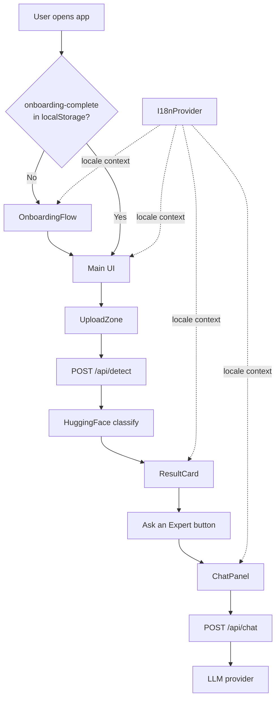
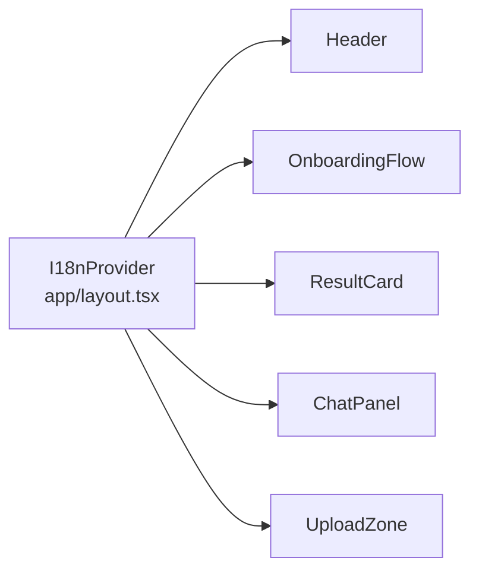

# Design Document — AfriCrop AI Sprint 2

## Overview

Sprint 2 extends the AfriCrop AI PWA from a cassava-only disease detector into a multi-crop, multi-language agricultural assistant. The existing architecture — Next.js 14 app router, HuggingFace inference, idb-keyval for offline caching, Vitest unit tests — is preserved and extended. No new runtime dependencies are introduced beyond what is already in `package.json`, except for a property-based testing library (`fast-check`) added to `devDependencies`.

The four capability areas delivered in this sprint are:

1. **Expanded Advisory Engine** — advisory data for Cassava, Maize, Bean, and Tomato diseases with structured symptoms, treatment, and prevention fields in English and Swahili.
2. **Multi-language Support** — an `I18n_Provider` React context supplying translated UI strings for `en` and `sw` locales, with optional `fr` support, persisted to `localStorage`.
3. **UI/UX Improvements** — a 3-step first-run onboarding flow, animated detection progress, and an enriched `ResultCard` with confidence bar, severity badge, collapsible alternatives, share button, and low-confidence warning.
4. **Ask an Expert** — a `ChatPanel` component backed by a new `POST /api/chat` server route that proxies messages to the HuggingFace Inference API (or any OpenAI-compatible LLM), with `localStorage` persistence capped at 50 messages.

All new features remain offline-capable where technically feasible: advisory data is pre-cached in IndexedDB, chat history is stored in `localStorage`, and the chat feature degrades gracefully when offline.

---

## Architecture

The application follows the existing Next.js App Router pattern. Sprint 2 adds a new context layer and two new UI components without restructuring the existing file layout.

```
app/
  layout.tsx              ← wraps children in I18nProvider
  page.tsx                ← main page; conditionally renders OnboardingFlow or main UI
  api/
    detect/route.ts       ← existing (unchanged)
    chat/route.ts         ← NEW: LLM proxy endpoint

components/ui/
  header.tsx              ← extended: language selector
  upload-zone.tsx         ← extended: animated progress overlay
  result-card.tsx         ← extended: severity badge, confidence bar, share, collapsible alts
  history-panel.tsx       ← unchanged
  onboarding-flow.tsx     ← NEW: 3-step first-run walkthrough
  chat-panel.tsx          ← NEW: Expert Chat UI

lib/
  advisory.ts             ← extended: full crop/disease data, sw translations, default fallback
  classify.ts             ← extended: multi-crop label map
  history.ts              ← unchanged
  labels.ts               ← extended: Maize, Bean, Tomato labels
  i18n.ts                 ← NEW: translation dictionaries and useI18n hook
```

### Data Flow



### Context Architecture

`I18nProvider` wraps the entire app in `app/layout.tsx`. It exposes a `useI18n()` hook that returns `{ locale, setLocale, t }` where `t(key)` returns the translated string for the active locale.



---

## Components and Interfaces

### `lib/i18n.ts`

```typescript
export type Locale = "en" | "sw" | "fr";

export type TranslationKey =
  | "app.title"
  | "app.subtitle"
  | "nav.selectLanguage"
  | "upload.dropPrompt"
  | "upload.browse"
  | "upload.camera"
  | "detect.button"
  | "detect.analysing"
  | "detect.offline"
  | "detect.error"
  | "result.primaryDiagnosis"
  | "result.confidence"
  | "result.lowConfidence"
  | "result.symptoms"
  | "result.treatment"
  | "result.prevention"
  | "result.otherPossibilities"
  | "result.share"
  | "result.shareCopied"
  | "result.healthy"
  | "result.scanAnother"
  | "result.severity.high"
  | "result.severity.medium"
  | "result.severity.low"
  | "chat.title"
  | "chat.placeholder"
  | "chat.send"
  | "chat.error"
  | "chat.typing"
  | "chat.charCount"
  | "onboarding.skip"
  | "onboarding.next"
  | "onboarding.getStarted"
  | "onboarding.step1.title"
  | "onboarding.step1.body"
  | "onboarding.step2.title"
  | "onboarding.step2.body"
  | "onboarding.step3.title"
  | "onboarding.step3.body"
  | "offline.banner";

export type Translations = Record<TranslationKey, string>;
export type TranslationMap = Record<Locale, Translations>;

export interface I18nContextValue {
  locale: Locale;
  setLocale: (locale: Locale) => void;
  t: (key: TranslationKey) => string;
}
```

The `translations` object in `lib/i18n.ts` contains all strings for `en` and `sw` (and optionally `fr`). The `I18nProvider` component reads the persisted locale from `localStorage` on mount and writes it back on every `setLocale` call.

### `lib/advisory.ts` — Extended Interface

```typescript
export interface Advisory {
  title: string;
  summary: string;
  symptoms: string[]; // NEW — at least 2 items
  actions: string[];
  prevention: string[];
  titleSw?: string;
  summarySw?: string;
  symptomsSw?: string[];
  actionsSw?: string[];
  preventionSw?: string[];
  severity: "High" | "Medium" | "Low"; // NEW
}
```

The advisory data map is keyed by the English label string (e.g., `"Cassava Bacterial Blight"`). A `DEFAULT_ADVISORY` constant is returned for unrecognised labels.

`getAdvisory(label, locale?)` returns the advisory with fields resolved to the requested locale. When `locale === "sw"`, the `*Sw` fields are used if present, falling back to English.

### `components/ui/onboarding-flow.tsx`

```typescript
interface OnboardingFlowProps {
  onComplete: () => void;
}
```

Renders a full-screen overlay with three slides. Tracks current step in local state. On the final step's "Get Started" button or the "Skip" button at any step, calls `onComplete()` which sets `localStorage["africrop-onboarding-complete"] = "true"`.

### `components/ui/chat-panel.tsx`

```typescript
interface ChatMessage {
  role: "user" | "assistant";
  content: string;
  timestamp: number;
}

interface ChatPanelProps {
  detectionResult?: DetectionResult | null;
  onClose: () => void;
}
```

Manages chat state in React state, persisted to `localStorage["africrop-chat-history"]` (max 50 messages). Sends `POST /api/chat` with the current messages array (last 20) and optional detection context. Displays a typing indicator while awaiting response. Input is limited to 500 characters with a live counter.

### `app/api/chat/route.ts`

```typescript
// Request body
interface ChatRequest {
  messages: Array<{ role: "user" | "assistant"; content: string }>;
  context?: DetectionResult;
  locale?: string;
}

// Success response
interface ChatResponse {
  reply: string;
}

// Error responses
// 400: { error: "Invalid request" }
// 413: { error: "Request too large" }
// 502: { error: "LLM provider error" }
```

The route:

1. Validates `messages` is a non-empty array.
2. Checks total character count ≤ 10,000; returns 413 otherwise.
3. Trims `messages` to the last 20 items.
4. Builds a system prompt that includes the active locale and, if present, a summary of the detection context.
5. Calls the HuggingFace Inference API (text generation) using `process.env.HF_TOKEN`.
6. Returns `{ reply }` on success, `{ error: "LLM provider error" }` with 502 on provider failure.

---

## Data Models

### Advisory Data Map

All 13 required crop-disease combinations plus healthy baselines are stored in `lib/advisory.ts`. Each entry follows the `Advisory` interface. Example structure:

```typescript
const advisoryData: Record<string, Advisory> = {
  "Cassava Bacterial Blight": {
    title: "Cassava Bacterial Blight",
    titleSw: "Ugonjwa wa Bakteria wa Muhogo",
    summary:
      "A bacterial disease causing angular leaf spots and stem dieback...",
    summarySw: "Ugonjwa wa bakteria unaosababisha madoa ya pembetatu...",
    symptoms: ["Angular water-soaked leaf spots", "Wilting and stem dieback"],
    symptomsSw: [
      "Madoa ya maji yenye pembe kwenye majani",
      "Kunyauka na kufa kwa shina",
    ],
    actions: [
      "Remove and burn infected plant parts",
      "Apply copper-based bactericide",
    ],
    actionsSw: [
      "Ondoa na kuchoma sehemu zilizoathirika",
      "Tumia dawa ya shaba",
    ],
    prevention: [
      "Use certified disease-free cuttings",
      "Rotate crops every season",
    ],
    preventionSw: [
      "Tumia vipande vilivyothibitishwa",
      "Zungusha mazao kila msimu",
    ],
    severity: "High",
  },
  // ... all other entries
  Healthy: {
    title: "Healthy Plant",
    titleSw: "Mmea Mzima",
    summary: "No disease detected. Your crop appears healthy.",
    summarySw: "Hakuna ugonjwa uliogunduliwa. Zao lako linaonekana kuwa zima.",
    symptoms: [],
    symptomsSw: [],
    actions: [
      "Continue regular monitoring",
      "Maintain good agricultural practices",
    ],
    actionsSw: [
      "Endelea kufuatilia mara kwa mara",
      "Dumisha mazoea mazuri ya kilimo",
    ],
    prevention: ["Rotate crops regularly", "Use certified seeds"],
    preventionSw: [
      "Zungusha mazao mara kwa mara",
      "Tumia mbegu zilizothibitishwa",
    ],
    severity: "Low",
  },
};
```

### Chat Message Persistence

Chat history is stored in `localStorage["africrop-chat-history"]` as a JSON array of `ChatMessage` objects. On load, the array is parsed and the last 50 messages are kept. On each new message pair (user + assistant), the array is trimmed to 50 before writing back.

### Onboarding State

A single `localStorage` key `"africrop-onboarding-complete"` with value `"true"` gates the onboarding flow. Absence of the key (or any value other than `"true"`) triggers the flow.

### Locale Persistence

The active locale is stored in `localStorage["africrop-locale"]` as a BCP-47 string (`"en"`, `"sw"`, or `"fr"`). The `I18nProvider` reads this on mount and defaults to `"en"` if absent or unrecognised.

---

## Correctness Properties

_A property is a characteristic or behavior that should hold true across all valid executions of a system — essentially, a formal statement about what the system should do. Properties serve as the bridge between human-readable specifications and machine-verifiable correctness guarantees._

This feature uses **fast-check** for property-based testing. Each property test runs a minimum of 100 iterations.

### Property 1: Advisory structural completeness

_For any_ label present in the advisory data map, calling `getAdvisory(label)` SHALL return an `Advisory` object where `symptoms.length >= 2`, `actions.length >= 2`, and `prevention.length >= 2`, and all string fields (`title`, `summary`) are non-empty.

**Validates: Requirements 1.2**

---

### Property 2: Advisory serialisation round-trip

_For any_ `Advisory` object, serialising it with `JSON.stringify` and then deserialising with `JSON.parse` SHALL produce an object that is deeply equal to the original.

**Validates: Requirements 1.6**

---

### Property 3: Unknown label returns non-null default

_For any_ string that is not a key in the advisory data map, `getAdvisory(label)` SHALL return a non-null `Advisory` object (the default fallback), never `null` or `undefined`.

**Validates: Requirements 1.3**

---

### Property 4: Translation key completeness

_For any_ translation key defined in the `en` locale dictionary, the `sw` locale dictionary SHALL contain the same key mapped to a non-empty string.

**Validates: Requirements 3.7**

---

### Property 5: Swahili advisory field completeness

_For any_ label in the advisory data map, the advisory record SHALL have non-empty `titleSw`, `summarySw`, `symptomsSw` (length ≥ 2 for disease entries), `actionsSw` (length ≥ 2), and `preventionSw` (length ≥ 2).

**Validates: Requirements 3.3**

---

### Property 6: Locale persistence round-trip

_For any_ supported locale value (`"en"`, `"sw"`, `"fr"`), calling `setLocale(locale)` SHALL write the value to `localStorage["africrop-locale"]`, and a fresh `I18nProvider` initialisation SHALL read back the same locale.

**Validates: Requirements 3.5**

---

### Property 7: Confidence threshold warning

_For any_ `Confidence_Score` value in the range [0, 1], the `ResultCard` SHALL display the low-confidence warning if and only if the score is strictly less than 0.60.

**Validates: Requirements 8.3**

---

### Property 8: Confidence bar width matches score

_For any_ `Confidence_Score` value in the range [0, 1], the confidence progress bar's rendered width percentage SHALL equal `Math.round(score * 100)` percent (within ±1 percentage point rounding tolerance).

**Validates: Requirements 8.2**

---

### Property 9: Chat message cap invariant

_For any_ sequence of `n` chat messages added to the chat history, the number of messages persisted to `localStorage` SHALL be `min(n, 50)`.

**Validates: Requirements 9.7**

---

### Property 10: Chat input character limit

_For any_ string of length > 500 characters, the `ChatPanel` input SHALL NOT allow submission, and the character count display SHALL show the current length.

**Validates: Requirements 9.8**

---

### Property 11: Chat API message truncation

_For any_ `messages` array of length `n`, the `POST /api/chat` handler SHALL forward exactly `min(n, 20)` messages to the LLM provider (the last 20 when `n > 20`).

**Validates: Requirements 10.5**

---

### Property 12: Chat API character limit enforcement

_For any_ request where the total character count of all message content exceeds 10,000, the `POST /api/chat` handler SHALL return HTTP 413 with `{ error: "Request too large" }`.

**Validates: Requirements 10.6**

---

### Property 13: Chat API invalid request rejection

_For any_ request body that is missing the `messages` field or where `messages` is not an array, the `POST /api/chat` handler SHALL return HTTP 400 with `{ error: "Invalid request" }`.

**Validates: Requirements 10.3**

---

### Property 14: Onboarding locale rendering

_For any_ supported locale, the `OnboardingFlow` component SHALL render all visible text strings using translations from that locale's dictionary (no English strings appear when locale is `sw`).

**Validates: Requirements 6.6**

---

### Property 15: Severity badge validity

_For any_ disease label in the advisory data map, the `ResultCard` severity badge SHALL display exactly one of `"High"`, `"Medium"`, or `"Low"`, and the badge colour SHALL match the severity (red for High, amber for Medium, emerald for Low/Healthy).

**Validates: Requirements 2.5**

---

## Error Handling

### Advisory Engine

- **Unknown label**: `getAdvisory` returns `DEFAULT_ADVISORY` — a generic advisory with `"consult a local agronomist"` messaging. Never returns `null`.
- **IndexedDB unavailable**: `cacheAdvisoryData` catches errors and falls back to the in-memory `advisoryData` object. `getAdvisory` always has a fallback.

### Detection API (`/api/detect`)

- Existing error handling is preserved (413 for oversized images, 400 for missing file, 500 for inference failure).

### Chat API (`/api/chat`)

- **Missing/invalid `messages`**: 400 `{ error: "Invalid request" }`.
- **Total chars > 10,000**: 413 `{ error: "Request too large" }`.
- **LLM provider error or timeout**: 502 `{ error: "LLM provider error" }`.
- **Missing `HF_TOKEN`**: The route returns 502 immediately rather than making an unauthenticated call.

### I18n Provider

- **Missing translation key**: `t(key)` returns the key string itself as a fallback (never throws). This makes missing translations visible in the UI without crashing.
- **Corrupt `localStorage` locale**: Falls back to `"en"`.

### Chat Panel (Client)

- **Network failure**: Displays `"Could not reach the expert — please try again."` inline.
- **Timeout (15 s)**: `AbortController` cancels the fetch; same error message is shown.
- **Offline**: Detects `!navigator.onLine` before submitting and shows the offline warning immediately.

### Onboarding Flow

- **`localStorage` unavailable** (e.g., private browsing with storage blocked): The flow is shown once per session but the completion flag write is wrapped in a try/catch; failure is silent.

---

## Testing Strategy

### Unit Tests (Vitest + jsdom)

Unit tests cover specific examples, edge cases, and error conditions. They are co-located in `tests/unit/`.

**Advisory Engine (`lib/advisory.ts`)**

- All 13+ required labels are present in the data map.
- `getAdvisory` with a known label returns the correct advisory.
- `getAdvisory` with an unknown label returns the default advisory (not null).
- `getAdvisory` with locale `"sw"` returns Swahili fields.

**I18n (`lib/i18n.ts`)**

- `t("detect.button")` returns `"Detect Disease"` for `en` and the Swahili equivalent for `sw`.
- Changing locale updates the returned string.
- Locale is persisted to and restored from `localStorage`.

**Chat history utilities**

- Chat history is capped at 50 messages.
- Messages are ordered newest-last.

**`/api/chat` route handler**

- Returns 400 for missing `messages`.
- Returns 400 for non-array `messages`.
- Returns 413 when total chars > 10,000.
- Truncates to last 20 messages before forwarding.
- Returns 502 when LLM provider throws.

### Property-Based Tests (Vitest + fast-check)

Property tests are in `tests/unit/` alongside unit tests, tagged with the property they validate.

**Library**: `fast-check` (added to `devDependencies`)
**Minimum iterations**: 100 per property (fast-check default is 100)
**Tag format**: `// Feature: africrop-ai-sprint-2, Property N: <property text>`

Each of the 15 correctness properties above maps to one property-based test. Key generators:

- `fc.constantFrom(...Object.keys(advisoryData))` — valid advisory labels
- `fc.string()` — arbitrary strings for unknown-label tests
- `fc.float({ min: 0, max: 1 })` — confidence scores
- `fc.array(fc.record({ role: fc.constantFrom("user","assistant"), content: fc.string() }))` — message arrays
- `fc.constantFrom("en", "sw", "fr")` — locale values

### End-to-End Tests (Playwright)

E2E tests in `tests/e2e/` cover the critical user journeys:

1. **First-run onboarding**: Fresh session → onboarding shown → complete → main UI shown → refresh → onboarding not shown.
2. **Language switch**: Switch to Swahili → UI strings update → refresh → Swahili persists.
3. **Detection flow**: Upload image → detect → result card shows severity badge, confidence bar, advisory sections.
4. **Low-confidence warning**: Mock API to return confidence 0.45 → warning banner visible.
5. **Share result**: Click share → clipboard mock receives plain-text summary → toast appears.
6. **Expert Chat**: Open chat → type message → mock API → response appears → history persists on refresh.
7. **Offline mode**: Service worker intercepts → offline banner shown → advisory data still accessible.

### Accessibility Checks

- All interactive elements have `aria-label` or associated `<label>`.
- Language selector has `aria-label="Select language"`.
- Chat input has `aria-label` and character count announced via `aria-live`.
- Focus indicators are visible (checked via Playwright `page.keyboard.press("Tab")`).
- Lighthouse CI run in GitHub Actions targeting score ≥ 90 accessibility, ≥ 70 performance.
